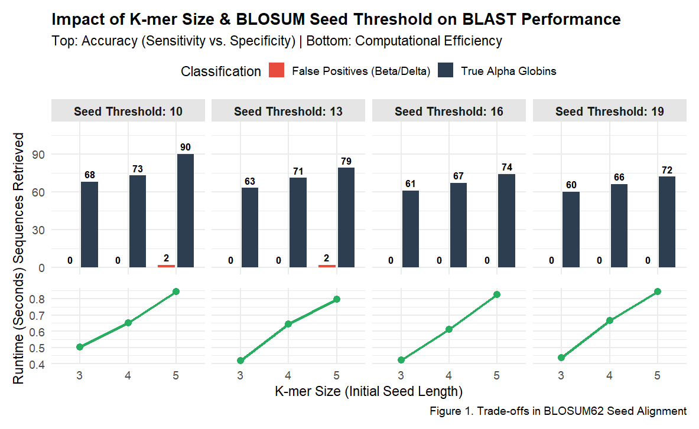
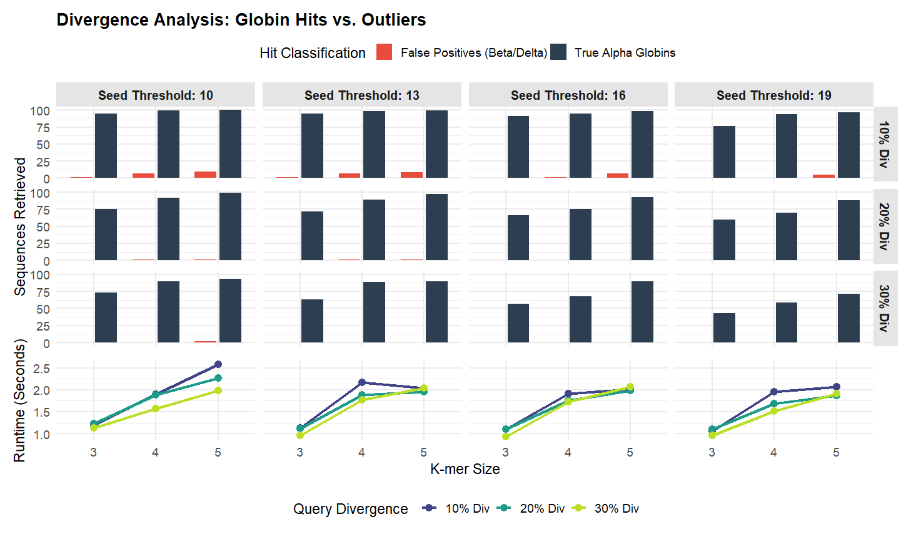
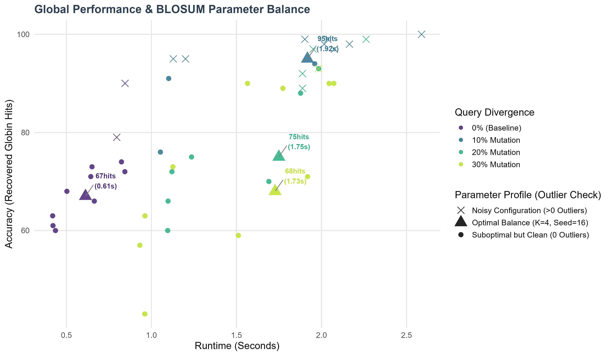

# BLAST-like Heuristic Sequence Aligner

## Overview
We implemented an optimized **BLAST-like seed-and-extend algorithm** designed for protein sequence alignment. Unlike basic algorithms that rely on exact identity matching, our implementation integrates the **BLOSUM62 substitution matrix** into the seeding phase. This allows the algorithm to detect homologous sequences that have diverged over evolutionary time, effectively simulating the behavior of professional tools like BLASTP.

---

## Technical Implementation
* **Similarity-based Seeding:** Instead of exact K-mer matching, we compute the cumulative substitution score for every query and target K-mer pair using the **BLOSUM62 matrix**. A seed is only validated and passed to the extension phase if its total score satisfies a configurable **Seed Threshold (T)**.
* **Algorithmic Optimization (Memoization):** To overcome performance bottlenecks inherent in nested matrix lookups, we extracted the BLOSUM62 data into a native Python dictionary (`fast_blosum`) and implemented **memoization**. By caching the similarity scores of previously evaluated K-mer pairs, this algorithmic technique drastically reduces redundant calculations, bringing execution times down to the ~1.5 seconds range.
* **Extension:** The algorithm uses a strictly ungapped extension approach with a fixed drop-off threshold of 5, providing a robust balance between sensitivity and computational cost.

---

## Database Composition
Our database contains 100 entries of *"hemoglobin subunit alpha"* retrieved from UniProt. To test the specificity and robustness of our heuristic, we manually augmented the dataset by including structural outliers: five *hemoglobin subunit beta* and five *hemoglobin subunit delta* sequences from different species. These act as our negative control set (out-groups) to measure false positive rates.

---

## Performance Analysis
To validate our implementation, we systematically varied the K-mer size ($K \in \{3, 4, 5\}$) and the BLOSUM62 Seed Threshold ($T \in \{10, 13, 16, 19\}$) using a human HBA query across four divergence levels (Baseline, 10%, 20%, 30%).

### 1. Specificity & Baseline Noise Filtering
This analysis focuses on our control set (Human Alpha Hemoglobin) and our ability to exclude structural outliers. Low seed thresholds allow significant background noise, whereas higher thresholds (T ≥ 16) successfully filter out false positives while maintaining sensitivity.

### 2. Sensitivity on Divergent Sequences
This plot demonstrates the evolutionary reach of our algorithm. By adjusting the BLOSUM62 seed threshold, we can recover distant homologs that exact-match algorithms would fail to detect.

### 3. Optimization & Global Trade-off
Finally, we analyzed the intersection of execution time and retrieval accuracy. This identifies the "sweet spot" for our parameters, showing how we balance computational efficiency with biological discovery.

**Conclusion:** Based on our systematic parameter sweep, we determined that **K-mer = 4** and **Seed Threshold = 16** provide the optimal performance profile. This configuration guarantees zero false positives, highly stable execution speeds, and robust recovery of distant globin homologs.